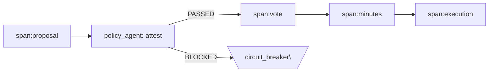

# LogLine para Engenheiros — 101

LogLine é **um protocolo operacional onde tudo é span** e **todo fato é verificável**: você canonicaliza → calcula **BLAKE3** → assina com **Ed25519** → **anexa no ledger (NDJSON)**. A **política** é executável, a **governança** é *machine-gated* e **toda decisão** deixa prova.

## 1) O “iconic core” em 10 linhas

```js
import { buildEntry } from '../../lib/logline.mjs'

const payload = { message: 'hello, ledger', t: '2025-11-16' }
const entry = await buildEntry({
  type: 'SPAN',
  id: 'SPAN-DEMO-0001',
  payload,
  privHex: '…chave_privada_hex…',
  pubHex: '…chave_publica_hex…',
  extra: { machine_gate: 'PASSED' }
})
// -> escreva como uma linha .ndjson no ledger
```

## 2) Canonicalização determinística

```js
export function canonicalize(obj){
  if (obj === null || typeof obj !== 'object') return JSON.stringify(obj)
  if (Array.isArray(obj)) return '[' + obj.map(canonicalize).join(',') + ']'
  const keys = Object.keys(obj).sort()
  return '{' + keys.map(k => JSON.stringify(k)+':'+canonicalize(obj[k])).join(',') + '}'
}
```

## 3) Hash + assinatura (BLAKE3 + Ed25519)

```js
import { createHash } from 'blake3'
import * as ed from '@noble/ed25519'

const canon = canonicalize(payload)
const hash_b3 = createHash().update(Buffer.from(canon)).digest('hex')
const signature_ed25519 = await ed.sign(Buffer.from(canon), Buffer.from(PRIV_HEX,'hex'))
```

## 4) Verificação — o *gate* mínimo

```js
const hashOk = (hash_b3 === createHash().update(Buffer.from(canon)).digest('hex'))
const sigOk  = await ed.verify(signature_ed25519, Buffer.from(canon), Buffer.from(PUB_HEX,'hex'))
const gate   = (hashOk && sigOk) ? 'PASSED' : 'BLOCKED'
```

## 5) “Tudo é span” — ciclo operacional



## 6) Attestation do policy_agent (pseudocódigo)

```js
function attest(decision){
  const checks = {
    quorum_ok,
    conflict_ok,
    agenda_freeze_ok,
    hash_ok,
    sig_ok
  }
  const attested = Object.values(checks).every(Boolean)
  return {
    agent:'policy_agent',
    attested,
    checks: Object.keys(checks).filter(k => checks[k]),
    timestamp: new Date().toISOString()
  }
}
```

## 7) Rito mínimo (Aprovar Política) — JSON✯Atomic

```json
{
  "type":"RIT","subtype":"aprovacao_politica","id":"RIT-AP-…",
  "fields":{"policy_draft_id":"POL-DRAFT-…","version":"v1.0"},
  "machine_gate":"PASSED",
  "compliance_attestation":{"agent":"policy_agent","attested":true,"checks":["hash_ok","sig_ok"]}
}
```

## 8) Rust — verificação (blake3 + ed25519-dalek)

```rust
use blake3;
use ed25519_dalek::{Signature, VerifyingKey};
use hex::FromHex;

fn verify(canon:&str, sig_hex:&str, pub_hex:&str) -> bool {
    let digest = blake3::hash(canon.as_bytes()).to_hex().to_string();
    let sig = Signature::from_bytes(&Vec::from_hex(sig_hex).unwrap()).unwrap();
    let vk = VerifyingKey::from_bytes(&Vec::from_hex(pub_hex).unwrap()).unwrap();
    vk.verify_strict(canon.as_bytes(), &sig).is_ok()
}
```

## 9) Execução: `run_code(span_id)` (esqueleto)

```js
async function run_code(span_id) {
  const span = await registry.load(span_id)
  const handler = registry.resolve(span.payload.kind)
  const out = await handler(span.payload.input)
  return ledger.append(await buildEntry({
    type:'SPAN', id:`EXEC-{span_id}`, payload:{ parent:span_id, output: out }, /* …chaves… */
  }))
}
```

## 10) Idempotência por hash de conteúdo

```js
const key = createHash().update(Buffer.from(canonicalize(payload))).digest('hex')
if(await ledger.exists(key)) return 'SKIP' // já registrado
```

— **É isso.** Se você entende estas 10 peças, você entende o LogLine: **span → canônico → hash → assinatura → ledger → política → execução → prova**.

> Dica: rode `npm run demo:gen` e veja o **Ledger Viewer** validar um arquivo real com BLAKE3 e Ed25519.
